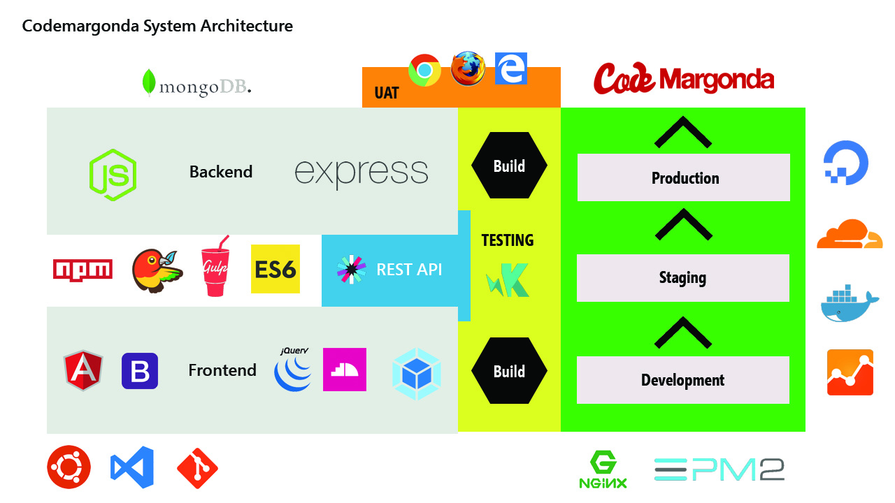

# Code Margonda

# 

|LICENSE| Margodev | CCC | CCC LMS |
|-------|------|---------|----------|
||  |  |  |
--------------------------------------------------

## Description

Code Margonda is a co-working space located in depok, indonesia. Focused in technology, our dream are to create the best developers in Indonesia. At Code Margonda, you don't just work here, but also colaborate, share stories and experiences with others

Code Margonda web system development aims to facilitate users who want to use our Co-Working space and/or Event Room. With this update, users can easily register themselves through a more efficient system with the latest and optimized web technologies.

--------------------------------------------------

## Team Member

| Name                  | Email                 | GitHub |
|-----------------------|-----------------------|--------|
| Fuad Aji Pratomo      | fuadajipratomo@gmail.com | [@fuadajip](https://github.com/fuadajip)
| Nico Ariesto Gilani       |  nicoariestogilani@gmail.com |[@nicogilani](https://github.com/nicogilani)

## Functionality

    ## User
    * User can book room for event, meeting etc.
    * User can make reservation for coworkingspace.
    * User can send a message or question to admin.
    

    ## Admin
    * Admin can check list all book room (waiting, on process, finished)
    * Admin can confirmed and managing all users that using coworking space
    * Admin can read and reply messages or feedback from users
    * Coming Soon

## STACK

## Prototype

https://marvelapp.com/55fhddb